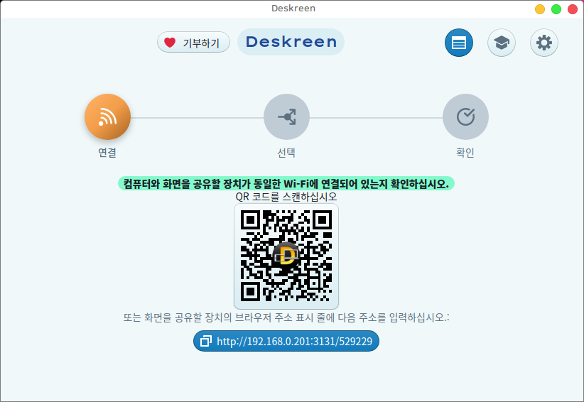

# Deskreen 화면 공유 프로그램



이 프로그램은 윈도우, 리눅스, 맥, 모바일 등 웹 브라우저가 있는 모든 장치를 WiFi 를 통해 컴퓨터의 보조화면으로 바꾸는 데스크탑 프로그램으로 전체 컴퓨터 디스플레이를 웹 브라우저가 있는 모든 장치 화면으로 미러링하는 데 사용될 수 있습니다. 

또한 공유할 응용 프로그램 창 보기를 하나만 선택하도록 제한할 수 있으며, 이는 프레젠테이션 용도로 매우 유용합니다. 

어떤 장치라도 보조 스크린으로 사용하는 것이 가능합니다. (이런 확장 데스크톱 환경을 위해서는 가상 디스플레이 어댑터와 함께 사용 필요)

 * upstream : https://github.com/pavlobu/deskreen

이 저장소는 하모니카 사용자를 위한 데비안 패키지를 제공하기 위해 업스트림에서 한글화를 적용하고 패키지를 제공합니다.

# 프로그램 설치

## 하모니카 사용자 (HamoniKR 3.0 이상)
```
sudo apt update
sudo apt install deskreen
```

## Other Ubuntu based distro
```
# add hamonikr apt repo
wget -qO- https://pkg.hamonikr.org/add-hamonikr.apt | sudo -E bash -

# install
sudo apt install deskreen
```

## Windows
Get the .msi or .exe file from below link
* https://github.com/pavlobu/deskreen/releases/download/v1.0.11/Deskreen.1.0.11.msi
* https://github.com/pavlobu/deskreen/releases/download/v1.0.11/Deskreen.Setup.1.0.11.exe

## Mac
Get the .dmg file from below link
* https://github.com/pavlobu/deskreen/releases/download/v1.0.11/Deskreen-1.0.11.dmg

Or get from Homebrew: brew install --cask deskreen

## Other Linux
Get the .rpm file from below link
 * https://github.com/pavlobu/deskreen/releases/download/v1.0.11/deskreen-1.0.11.x86_64.rpm 
Or
Arch Linux AUR Package(https://aur.archlinux.org/packages/deskreen/)

## Appimage 또는 rpm 패키지 제작하기
```
https://github.com/hamonikr/deskreen.git

yarn package
```
이 명령을 실행하면 release/ 폴더에 패키지 파일이 생성됩니다.

<hr>

[]()


### Website: https://deskreen.com


[](https://codecov.io/gh/pavlobu/deskreen)


## Get Started for Developers

### Run `yarn test-all` locally to make sure you don't have any errors, before submitting your PR

### Prerequisites

You will need to have `node` `npm` and `yarn` installed
globally on your machine.

1. git clone this repo
2. `cd app/client; yarn install --frozen-lockfile ; cd ../../ ; yarn install --frozen-lockfile`
3. `yarn dev` -- run in dev mode with live updates

### Useful yarn commands

`yarn start` -- run in production mode to test, without packaging
`yarn package` -- to package an app and make executables available in `release` folder

#### for more yarn commands look at `package.json`

### How to run tests

`yarn test` -- run all unit tests
`yarn build-ux && yarn test-ux` -- run User Experience tests (no tests for `app/client` yet)

### TODO: add e2e tests with host + client app interaction

#### run tests of host app

`yarn test-watch-not-silent` -- run tests in watch mode with console logs only for host app, excluding `app/client`
`yarn test -- -u` -- update snapshots

#### run tests for `app/client`

`yarn test` -- run client tests in watch mode
`test:nowatch` -- run client tests a single time
`yarn test -- -u` -- update snapshots

### Generate test coverage results

`yarn coverage` -- when run from project root, generates a coverage report for `host` and `app/client`

### How to regenerate snapshots if you have tests failing when running `yarn test`?

in root `./` folder of project run this:

```
yarn jest --updateSnapshot
```

in Deskreen Viewer `./app/client` folder of project run this:

```
cd app/client
SKIP_PREFLIGHT_CHECK=true yarn test:nowatch -- -u
```

### Run `yarn test-all` locally to make sure you don't have any errors, before submitting your PR

## Instruction for running a local Sonar Qube, community edition

### Prerequisites

You need to install Sonar Qube community edition for your machine.
And sonar-scanner. Then add sonar scanner to your PATH.

You need to run sonar-scanner separately on root directory
and on `app/client` directory.

Luckily for you sonar scanner is automatically triggered after `husky` checks.
So you only need to install and configure SonarCube locally and
create two separate projects in SonarCube panel.
First project for host app, and second project for client viewer app.
TODO: add how to get started with local SonarCube for Deskreen in details.

## Documentation

### High level architecture design


### WebRTC Screen Sharing Session Initiation Step by Step


### Benchmarks:

[Benchmarks can be found here](./doc/benchmarks)
